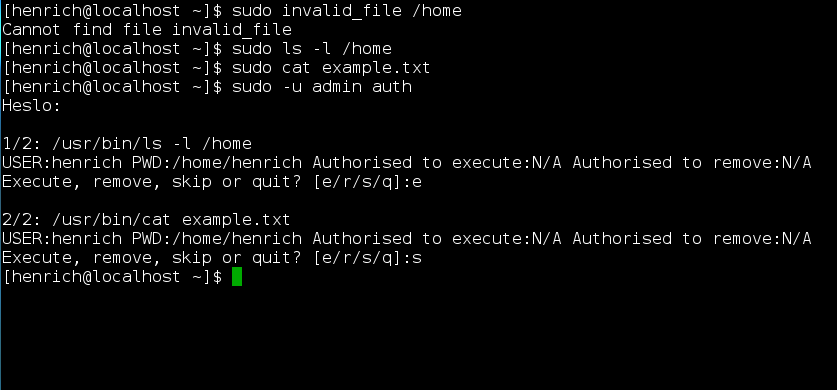

Dual-authorization plugin for sudo, allows to run commands (as root user) only after authorization by 2 different users.

Requirements:
Sudo 1.8 and newer

Installation:
run "make install" as root

Uninstallation:
run "make uninstall" as root

[Configuration file example](examples/sudo_security_plugin.conf)
